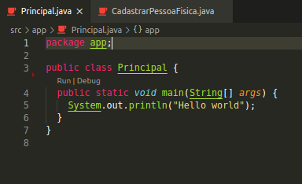

## OO Dummy Project

Pra quem usa Visual Studio Code, vai facilitar baixar esse 
[pack de extensões Java](https://marketplace.visualstudio.com/items?itemName=vscjava.vscode-java-pack)

E seguir esse [tutorial](https://code.visualstudio.com/docs/java/java-tutorial)
 pra montar um ambiente de desenvolvimento Java no VSCode.

Se tudo der certo você deve ver algo assim no seu editor:

Então você vai poder rodar o projeto clicando em `Run` ou debugar clicando
em `Debug` (dado que você adicionou breakpoints).
